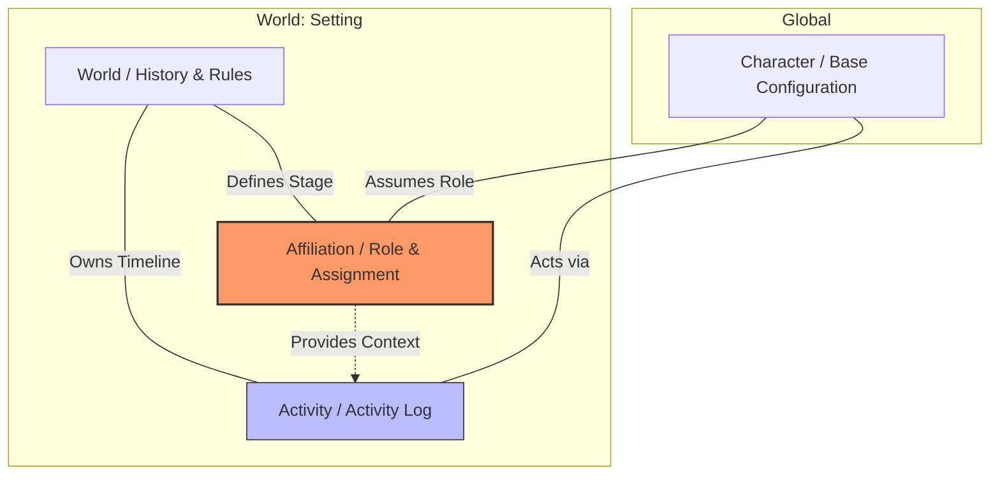

# Ori-Chara Chronicle
**— An archival infrastructure for creative activities, integrating multi-layered identities and contexts —**

## The Problem

In contemporary creative communities (particularly the "Ori-Chara" or original character culture), creators' activity data is scattered across ephemeral, flow-based social media and unstructured collections. This leads to three major "losses":

- Fragmentation of Identity & Context: Data is buried in timelines. When the same character participates in multiple parallel settings (multiverse), there is no structural way to manage or accumulate these as independent "histories."

- Governance Gap: In collaborations involving others' characters, the lack of a "Trust Protocol"—such as clear consensus on settings or approval processes—creates psychological barriers to safe creative expansion.

- Sustainability Crisis: The cost of maintaining high-quality assets is a burden on individuals. The lifespan of creative activities is overly dependent on platform survival and personal resources.

## Core Concepts (4 Logical Elements)



OCC structures creative data by separating it into immutable assets, settings, and definitions of belonging.

- Character (Base Configuration): Immutable master data shared across all parallel worlds (e.g., appearance, core personality).

- World (Setting): An environment/stage with its own unique rules and timeline.

- Affiliation (Role/Assignment): The core of the system. Configuration that links a Character to a World. Defines the character's status, relationships, and parallel settings specific to that world.

- Activity (Activity Log): Concrete creative records/works etched into a World's timeline. Each activity is performed through a specific Affiliation.

## Core Workflow (MVP Experience)

OCC seamlessly expands from personal setting management to collaborative creation through the following steps:

1. Register Character: Define base information used across all worlds.

2. Build World & Define Affiliation: Create your own stage (World) and define your character's role (Affiliation) within it.

3. Operate as a Structured Archive: By posting Activities, the system functions as an automatically organized "Context-Aware Archive" based on metadata.

4. Join Other Worlds: Apply for a new Affiliation in a World managed by others. Start collaborating safely while maintaining data integrity across different settings.

## Collaboration & Rights Management (Governance)

OCC provides a protocol to ensure data integrity during interactions with characters owned by others.

- Multi-party Approval: When joining another's "World" or recording an "Activity" involving multiple characters, the system requires consensus from all stakeholders. This prevents unauthorized setting changes or publications.

- Soul Integrity: All interactions occur via the Affiliation layer. Creators can enjoy infinite parallel worlds while protecting the purity of their base "Character" master data.

- Progressive Trust: - Users can choose "Auto-approval" or "Post-hoc Moderation" between trusted partners.

- Governance intensity can be flexibly adjusted based on community maturity or the significance of the activity (e.g., "Canon" vs. "Non-canon").

## Vision

The purpose of OCC is not merely to provide a data storage tool.

Our mission is "to build an infrastructure that turns every creative activity into an asset, backed by context and trust."

## Development

```bash
make dev
```

- Web: http://localhost:3000
- API: http://localhost:8080

### Frontend status

The frontend is currently **incomplete**. At this stage, only **character creation** is supported in the UI.

### API manual test

- You can try the API with `apps/api/Api.http`.
  - VS Code requires the REST Client extension.
  - JetBrains (IntelliJ/GoLand/Rider) can run it with the built-in HTTP Client.

## Documentation

Detailed specifications and architectural designs are provided below.

1. [Technical overview](./docs/10_technical_overview.md)

2. [ADRs](./docs/ADR/)
