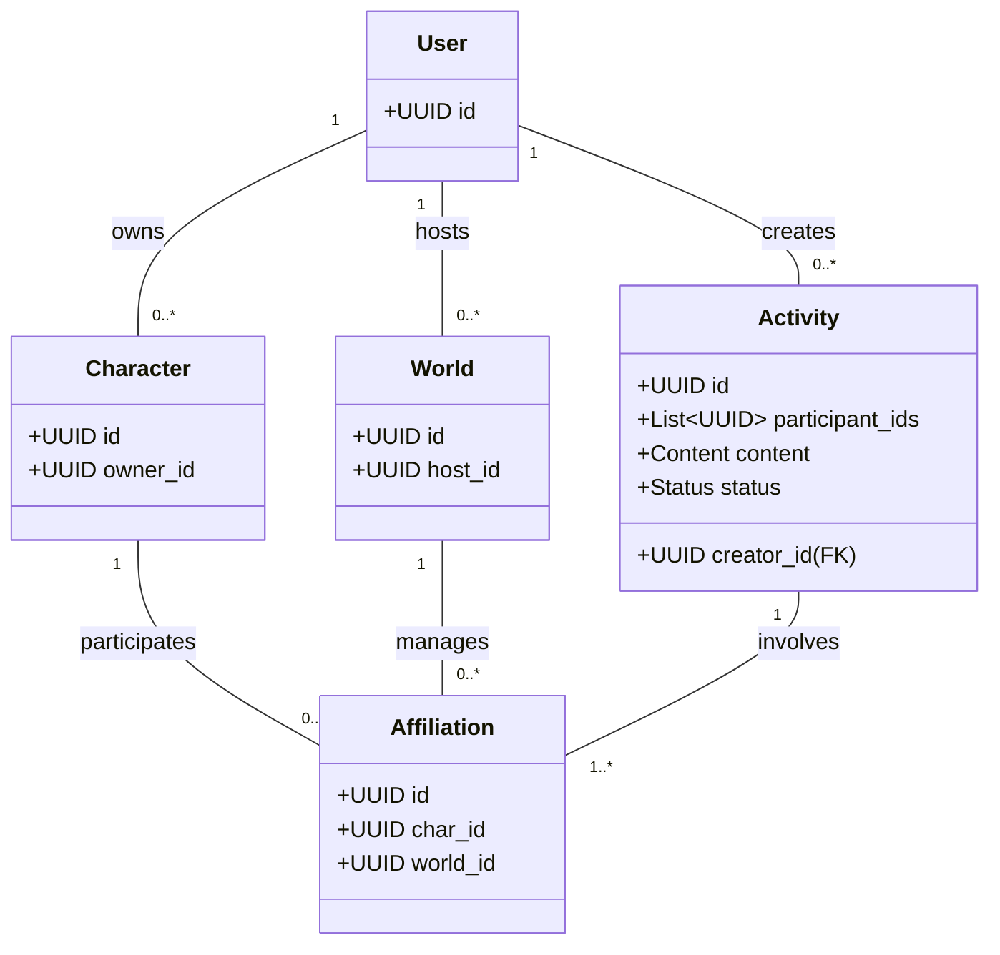
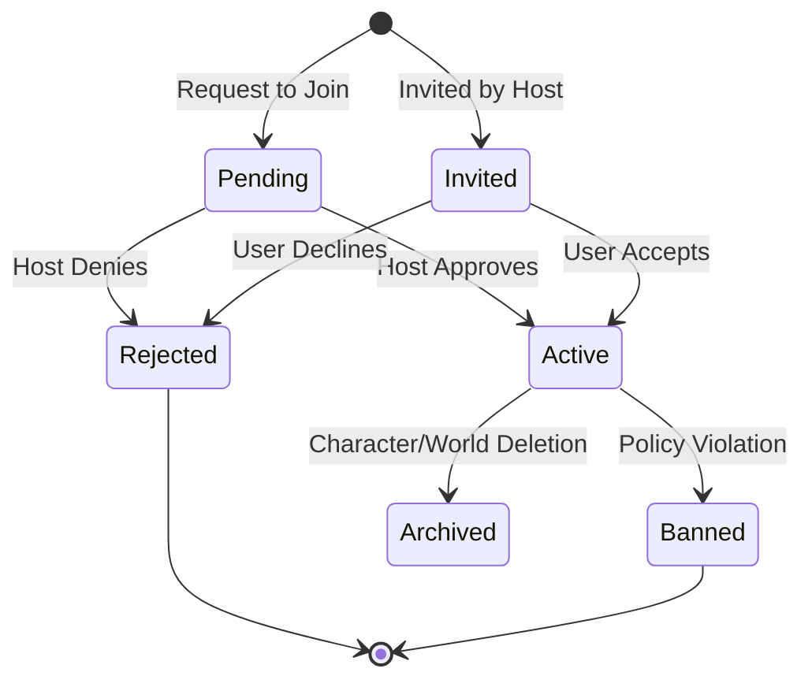
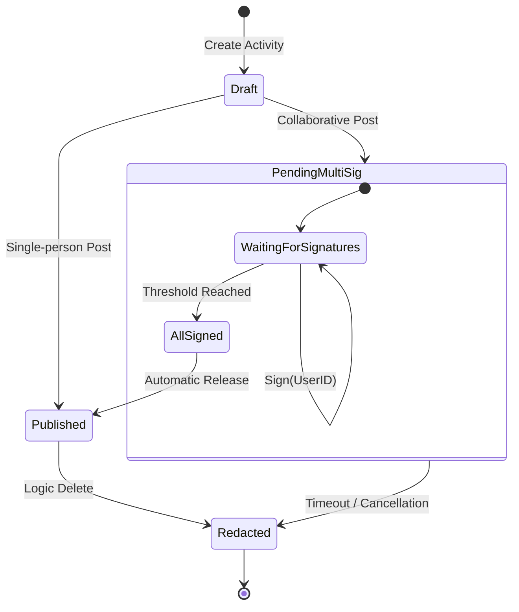

# Data Model

## 1. Domain Relationships

The following class diagram illustrates the core entities and their associations.

**Implementation Note:** To optimize performance and minimize database lookups, the `owner_id` is denormalized and stored directly within the `Affiliation` entity.

## 2. State Transitions

### 2.1 Affiliation Lifecycle

This diagram defines the process of a character joining or being removed from a world.

### 2.2 Activity Lifecycle (Multi-party Approval)

This flow manages the publication of activities, including those requiring consensus from multiple participants.

## 3. DynamoDB Physical Data Model

### 3.1 Primary Index (Base Table)

| **PK (Partition Key)** | **SK (Sort Key)**     | **Type**    | **Description / Usage**                                       |
| ---------------------- | --------------------- | ----------- | ------------------------------------------------------------- |
| `USER#<UserID>`        | `PROFILE`             | User        | Retrieve account profile information.                         |
| `USER#<UserID>`        | `OWN_CHAR#<CharID>`   | (Pointer)   | List all characters owned by the user.                        |
| `USER#<UserID>`        | `OWN_WORLD#<WorldID>` | (Pointer)   | List all worlds hosted by the user.                           |
| `CHAR#<CharID>`        | `INFO`                | Character   | Master data for character details.                            |
| `WORLD#<WorldID>`      | `INFO`                | World       | Master data for world settings and configuration.             |
| `WORLD#<WorldID>`      | `AFF#<CharID>`        | Affiliation | List of all participants (characters) within a world.         |
| `AFF#<AffID>`          | `ACT#<Timestamp>`     | Activity    | Activity history associated with a specific role/affiliation. |

### 3.2 Global Secondary Index (GSI)

|**Index Name**|**PK**|**SK**|**Usage**|
|---|---|---|---|
|`GSI_ReverseLookup`|`CHAR#<CharacterID>`|`AFF#<WorldID>`|Retrieve all worlds a specific character has joined.|
|`GSI_Timeline`|`WORLD#<WorldID>`|`ACT#<Timestamp>`|Fetch a chronological activity feed for an entire world.|
