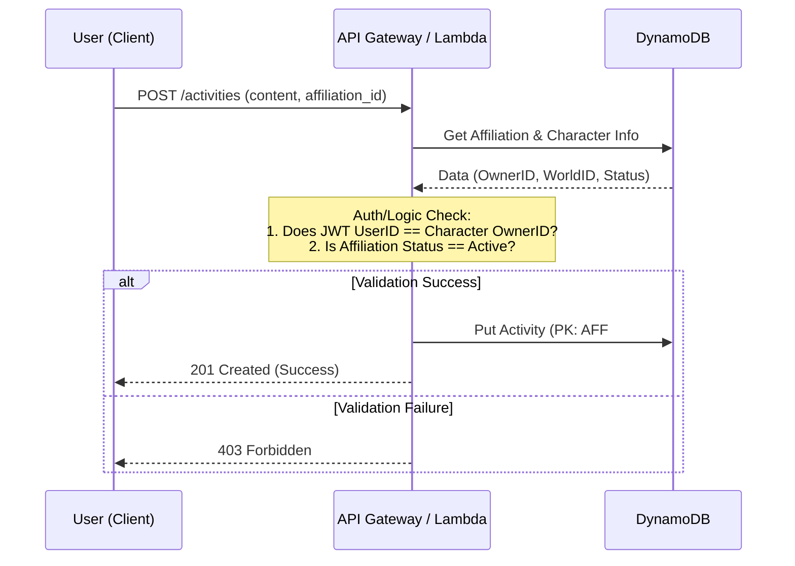
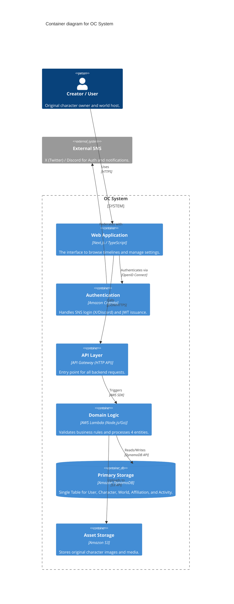
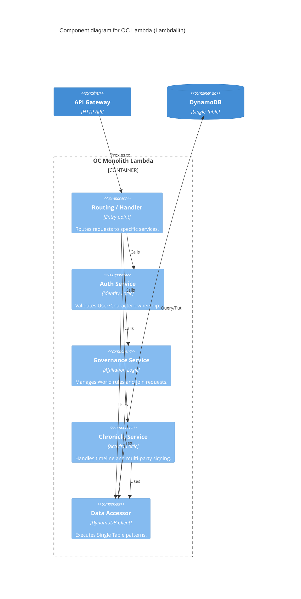

# API & System Architecture

## 1. Architecture Overview

To maximize cost efficiency and scalability, the system utilizes a **serverless architecture** centered around **Amazon API Gateway (HTTP API)** and **AWS Lambda**.

- **Authentication (Auth):**
	- Managed via **Amazon Cognito**. It federates with external providers (e.g., X/Discord) to issue **JWTs (JSON Web Tokens)** for client-side session management.
    
- **API Layer:**
	- **API Gateway (HTTP API)** serves as the entry point, routing requests to specific Lambda functions based on the payload and path.
    
- **Authorization:**
	- Every write operation is validated using a **Lambda Authorizer** or direct **Cognito Authorizer** to ensure the `UserID` in the token matches the resource owner's ID.

## 2. API Endpoint Definitions

### 2.1 Identity Management (Character & User)

- `GET /me`
	- Retrieves the logged-in user’s profile, owned Characters, and hosted Worlds.
    
- `POST /characters`
	- Creates a new Character profile.
    
- `PATCH /characters/{id}`
	- Updates existing character metadata.

### 2.2 Governance Management (World & Affiliation)

- `POST /worlds`
	- Creates a new World and grants "Host" permissions to the creator.
    
- `POST /worlds/{id}/join`
	- Submits a request to join a specific World (Creates an `Affiliation` with `Status: Pending`).
    
- `PATCH /affiliations/{id}/approve`
	- (Host only) Approves a join request (Updates `Status: Active`).

### 2.3 ### Record Keeping (Activity)

- `GET /worlds/{id}/timeline`
	- Fetches the chronological timeline of a world (utilizing the `GSI_Timeline` Query).
    
- `POST /activities`
	- Posts a new Activity.
    - **Validation:** Verifies that the `affiliation_id` is `Active` and that the requester owns the associated `Character`.
        
- `POST /activities/{id}/sign`
	- (For collaborative posts) Issues an approval signature for another user's Activity.

## 3. Sequence: Activity Posting & Context Validation

This flow demonstrates how the system validates the "Context" (Affiliation) of a post rather than treating it as a simple data entry.

## 4. Multi-party Approval Logic

For activities involving multiple characters (Collaborative Logs), visibility is controlled through the following state logic:

1. **Initial Submission:** The activity is created with `Status: PendingMultiSig`. It is excluded from the public `GSI_Timeline` (or filtered out by the client).
    
2. **Signing:** Other involved users call `POST /activities/{id}/sign`.
    
3. **Promotion:** Once the required signatures from all involved `Affiliations` are collected, the Lambda function updates the `Status` to `Published`, making it visible on the timeline.

## 5. System Diagrams (C4 Model)

### 5.1 System Context & Containers

### 5.2 Component Breakdown (The "Lambdalith")

