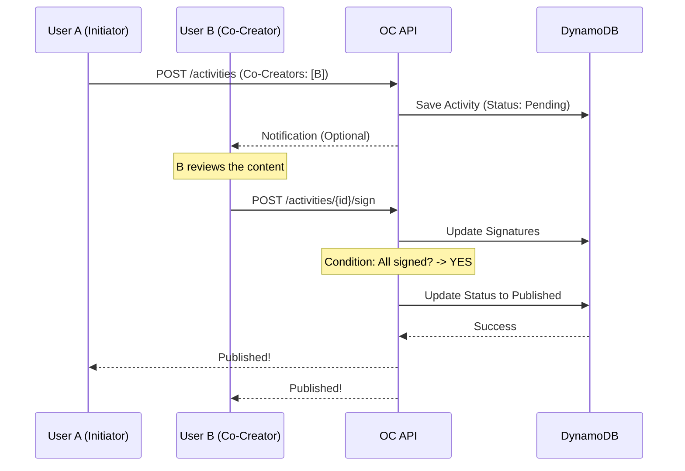

# Interaction Protocol & Collaborative Signing

## 1. Objectives

The objective of this protocol is to systematically eliminate disputes—such as "he-said, she-said" arguments or unauthorized use of character settings—within OC's collaborative activities (co-creation and interaction with other users' characters). It ensures the generation of immutable records based on mutual consensus.

## 2. Core Principles of Collaboration

1. **Affiliation-based Authorization:**
	- Every `Activity` must be linked to a specific `Affiliation` (role/identity).
    
2. **Multi-party Signature (Multi-sig):**
	- Any Activity involving multiple characters will not be published to the timeline until all parties have provided their digital signature.
    
3. **Irreversibility:**
	- Once a collaborative log is `Published`, it cannot be tampered with or altered without the explicit consent of all involved parties.
    

## 3. Workflow: Generating Collaborative Activities

### 3.1 Initiation

- **Actor:** The `AffiliationID` of the Initiator.
    
- **Action:** Send a `POST /activities` request including a `CoCreators` list (a list of the `AffiliationID`s of the other characters involved).
    
- **Internal State:** `Status: PendingMultiSig`
    
- **Database Behavior:** The Activity record is created but is flagged to be excluded from GSI (Timeline) queries.
    

### 3.2 Signing

- **Actor:** The `AffiliationID` of the Invitee(s).
    
- **Action:** Send a `POST /activities/{id}/sign` request.
    
- **Validation:** The Lambda function verifies that the signer is included in the `CoCreators` list and that the requester is the actual owner (User) of that Character.
    

### 3.3 Publication

- **Logic:** Upon the final signature, the Lambda function reconciles the signature list with the `CoCreators` list.
    
- **Trigger:** When all signatures are collected, the status is automatically promoted to `Status: Published`.
    
- **Result:** The Activity simultaneously appears on the timelines of the World and all participating characters.
    

## 4. Handling Edge Cases

### 4.1 Rejection

If any party refuses to sign, the Activity transitions to the `Redacted` state and is never made public. This prevents the exposure of interaction logs that lack total consensus.

### 4.2 Timeout

If all signatures are not collected within a specific timeframe (e.g., 14 days), the activity is automatically archived (hidden). This prevents "garbage data" from accumulating in the `Pending` state.

### 4.3 Modification Requests

If the content requires corrections, the protocol recommends moving the current activity to `Redacted` and having the Initiator start a new `Draft` to maintain data integrity and consistency.

## 5. Data Integrity

- **No Physical Deletion:** To maintain the integrity of the hash chain/history, even rejected interactions should be kept as logical deletes (`Redacted`) rather than being physically removed from the database.